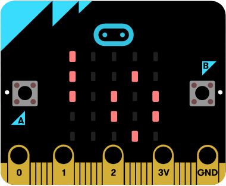

# bitio - A Micro:bit IO device

## What is this?

bitio (pronounced bitty-o) is a micro:bit I/O library for Python.
It allows you to run code in Python on a PC/Mac/Linux/Raspberry Pi
and interact directly with the micro:bit. It works with both Python 2 and
with Python 3 on Mac, PC, Raspberry Pi and Linux.



## Where is the latest version?

The bitio library was written in part to support a new chapter to the highly successful
childrens coding book 'Adventures in Minecraft'.

You can get the official version of the library that supports the book from here:

[Official version - on Adventures in Minecraft site](https://github.com/AdventuresInMinecraft/bitio)

If you want something a bit more leading edge with some experimental new features,
go right to the author's website and get the latest code from here:

[Development version - on whaleygeek site](https://github.com/whaleygeek/bitio)

It will soon be added to pypi, so very soon you will be able to do:
```pip install bitio```
or
```pip3 install bitio```

## What can I do with it?

This package is useful if you want to use the micro:bit as an input or an output
device for other programs, e.g. for Minecraft. Tilt your micro:bit, and
something happens in the Minecraft world. It can be used for anything
though, where you want to use the input and output devices on the micro:bit
inside a Python program on a bigger computer.

[About the Micro:bit](https://microbit.org)

[About MicroPython](https://python.microbit.org)

[About Minecraft](https://minecraft.net)

# Show me some projects!

Mr NCSComputing has written up a lot of projects using bitio and minecraft
together here: 

[Bitio with Minecraft](http://warksjammy.blogspot.co.uk/2017/07/bitio-blogs-in-one-place.html?view=timeslide)


# Getting Started

There are a number of ways you could get bitio installed, however this route is
designed to be mostly 'install free', specifically to make it easy for 
schools to use the package where there is a mostly locked-down Python
environment.

Press CLONE OR DOWNLOAD

choose DOWNLOAD ZIP

Unzip the zip file

Flash the bitio.hex file onto your micro:bit by dragging and dropping
it onto the MICROBIT drive that appears when you plug in your micro:bit.
The bitio logo will appear on the display to show you that it has
loaded correctly.

The best way to use the package in a restricted school environment is to
then just copy the 'microbit' folder into the students home folder.
Any Python programs that they write and store in their home folder will
now automatically find the 'microbit' package when they 'import microbit'
from any of their Python programs.


If you are on Windows, you first need to install the mbed serial driver
first before you can use the serial port on your micro:bit. You don't need to
do this on Mac/Pi/Linux as they have a compatible driver already built into the OS.
Note that you need admin access to your PC and the micro:bit must be plugged in
when you install the driver for it to work (but it says that on the web page
linked below)

For windows, follow these instructions:

[How to install the Windows mbed serial driver](https://support.microbit.org/solution/articles/19000022103-how-do-i-use-the-serial-port-with-a-micro-bit-on-windows)

## Making a connection

Run (in Python 2 or Python 3, both are supported) the counter.py example
that is in the src folder.

You could run this from the command prompt if you know how. But it is
also just as easy to open counter.py from within the IDLE editor
and run it, and it should work fine.

Follow the on screen instructions which will walk you through unplugging and
plugging back in the micro:bit, as a way to detect which serial port it is
connected to on your computer.

```
connecting...
warning:Could not open the serial port that was remembered from last time
Scanning for serial ports
remove micro:bit, then press ENTER
scanning...
found 132 micro:bit(s)
plug in micro:bit, then press ENTER
scanning...
found 133 micro:bit(s)
found 1 new micro:bit
selected:/dev/tty.usbmodem1422
Do you want this micro:bit to be remembered? (Y/N)y
Your micro:bit has been detected
Now running your program
```

Finally, you should get a counter counting from 00 to 99 in the WhaleySans font
(2x5 sized digits) on the display.

# Documentation

There are no official docs yet, but here is a short quick-reference to get you started.
Note I have added a microbit.sleep(2000) at the end of some examples, because
once your Python program finishes the bitio icon will be displayed on the
micro:bit again and this will overwrite whatever is on the micro:bit screen.

## Connecting to the micro:bit

```
    NOTE: Make sure bitio.hex is installed
    import microbit
```

## Scrolling text on the screen

```
    import microbit
    microbit.display.scroll("Hello")
    microbit.sleep(2000)
```

## Displaying a single character

```
    import microbit
    microbit.display.show("A")
    microbit.sleep(2000)
```

## Displaying numbers

```
    import microbit
    microbit.display.scroll(2345)
    microbit.sleep(2000)
```

## Displaying numbers using a 2-digit font

```
    import microbit
    for n in range(99):
        microbit.display.show(n)
        microbit.sleep(250)
```

## Getting a list of pre-defined images

```
    import microbit
    print(microbit.Image.STD_IMAGE_NAMES)
    microbit.sleep(2000)
```

## Displaying a pre-defined image

```
    import microbit
    microbit.display.show(microbit.Image.HAPPY)
    microbit.sleep(2000)
```

## Spinning a clock

```
    import microbit
    for c in microbit.Image.ALL_CLOCKS:
        microbit.display.show(c)
        microbit.sleep(250)
```
    
## Defining a custom image

```
    import microbit
    BANANA = microbit.Image("00090:00090:00990:09900:99000")
    microbit.display.show(BANANA)
    microbit.sleep(2000)
```

## Clearing the display

```
    import microbit
    microbit.display.clear()
    microbit.sleep(2000)
```

## Sensing when a button is pressed

```
    import microbit
    while True:
        if microbit.button_a.was_pressed():
            microbit.display.show("A")
            microbit.sleep(500)
            microbit.display.clear()
```
    
## Sensing when a pin is touched

```
    import microbit
    while True:
        if microbit.pin0.is_touched():
            microbit.display.show("T")
            microbit.sleep(500)
            microbit.display.clear()
```
    
## Reading accelerometer values

```
    import microbit
    while True:
        print(microbit.accelerometer.get_values())
        microbit.sleep(250)
```
  
## Sensing tilt in the X plane

```
    import microbit
    while True:
        x = microbit.accelerometer.get_x()
        x = abs(x)
        if x > 200:
            print("Tilted")
        else:
            print("Not Tilted")
        microbit.sleep(500)
```
  

# TODO ITEMS

These items are currently not implemented in this release, but will be added soon.

pin[3,4,5,6,7,8,9,10,11,12,13,14,15,16,17,18,19,20]
  digital_read()
  digital_write()
  analog_read()
  analog_write()
  set_pull()

display
  get_pixel(x, y)
  set_pixel(x, y, value)
  on()
  off()
  is_on()


# Sample programs

Here are a few sample programs you can use to get started

```
button.py  - sense a button press
counter.py - count from 00 to 99
sensing.py - sense buttons and accelerometer values
touched.py - sense pin touch
std_image.py - use in-built standard images
custom_image.py - define your own custom images
tilt.py - show how to sense tilt movements
tilt_mc.py - use the tilt with Minecraft
clocks.py - show a spinning clock
arrows.py - show a spinning arrow
```

Not all of the features of the micro:bit are made available via this
API yet, but we're working on it!

## MicroPython

The bitio code that runs at the micro:bit end is MicroPython.
The version of MicroPython cached inside this project is from here:

[MicroPython](https://codewith.mu/help/0.9.13/)


## Historical Perspective and timeline

On 9th May 2014 I published a package called 'anyio'. This was as a result of developing
a coding book called Adventures in Minecraft, and the desire to add some hardware chapters.
At the time, there wasn't a credible off the shelf GPIO like platform that worked out of the
box, for PC/Mac/Linux. So I created something a bit like RPi.GPIO but called it anyio,
so that it was possible to write Adventure 5, 9 and 10 of the book with minimal changes
between all platforms. Some work was done by SKPangUK as a local distributor, who
'finishes off' the board by soldering headers and pre-loading the anyio firmware, as well
as selling a bundled package with everything you need to follow the book.

Another key innovation inside anyio is the portscan package that I wrote. This works
on PC/Mac/Linux/Raspberry Pi and walks the user through a workflow of removing and inserting
the USB cable as a simple method to self-identify the port. This was key to reducing the size
of the setup instructions inside the 'Adventures in Minecraft' book, as it makes the workflow
identical on all 4 platforms. I have since used this workflow and package in lots of my
other example micro:bit programs inside my github code repository.

[anyio](https://github.com/whaleygeek/anyio)

[skpang anyio](http://skpang.co.uk/catalog/pro-micro-33v8mhz-with-headers-and-anyio-firmware-p-1327.html)


On 28th Jan 2016, I wrote a proof-of-concept in a project called 'mb_remote', which is here:

[mb_remote](https://github.com/whaleygeek/mb_remote)

This was built using an older version of MicroPython, and the API has changed since.
I spoke to a number of people that attended PyCon UK that year, and raised some interest.

This spawned similar work, e.g. this from Joe Glancy and Andrew Mulholland published on
9th May 2016 here:

[microperi](https://github.com/c0d3st0rm/microperi)

Much as I like this work, I never agreed with the name. The main reason is that I wanted
it to be possible to take an unmodified program written for the micro:bit, run it
on a PC/Mac/Linux/Raspberry Pi machine, and for it to work unmodified. Hence the module
name needs to be called 'microbit'.

Also, you will note that microperi requires manual connection to the micro:bit, whereas
bitio automatically connects when you import the module.

There are many places where I have used this, but the most recent is a 'micro:bit
radio gateway' project here:

[radio gateway](https://github.com/whaleygeek/microbit-gateway)


In May 2016, I had discussions with Ryan Walmsley from Ryantek, and he wanted to
build a board a bit like my anyio board but with Raspberry Pi HAT headers on it, and 
he asked for permissions to use my anyio library as a basis, which I agreed to. Ryan
ran a successful kickstarter and ended up building a retail packaged board with support
for I2C, SPI, and many of the boards in the huge Raspberry Pi HAT eco-system.

[RTk.GPIO board](https://ryanteck.uk/electronics/166-rtkgpio.html)


Roll forward to 2017, and discussions start to take place between myself and my co-author
Martin O'Hanlon about developing a 2nd edition of our highly successful childrens coding
book 'Adventures in Minecraft'. I had this idea that now that the micro:bit is widely
deployed and you can walk into real shops and buy them off of the shelf, it would be a much
easier to obtain platform than the Arduino/anyio board, and also provide progression
in both directions between Python on the micro:bit and Python on larger platforms.

Note a very influential (private) discussion with Nicholas Tollervy of the Python Software Foundation,
where he states that 'using Raw REPL would be a more robust protocol for driving this
sort of interface'. bitio uses the Raw REPL extensively.

[raw REPL](http://docs.micropython.org/en/v1.8.6/pyboard/reference/repl.html)

So, bitio is a step towards using the micro:bit as a general purpose IO device for bigger
computers like PC/Mac/Linux. You can of course also use it on the Raspberry Pi in addition
or instead of RPi.GPIO, but you get some lovely on-board sensors and a display built-in with the
micro:bit.

## What is next?

I have a big todo list (look in the docs folder). 

One key thing I want to do is to pull all my various micro:bit comms projects into this single package, 
including bringing in the microbit-gateway project for linking via the micro:bit radio network, amongst other features.

I think this work will also add a radio configuration feature with assistance at the
micro:bit end, so that it is possible to build multi channel frequency hopping gateways.
That is a bit of a long term plan at the moment though.

I also have a microbit.GPIO idea in the making, where it could be used a bit like RPi.GPIO
and form part of my anyio package as another supported platform.


David Whale

@whaleygeek

1st July 2017


